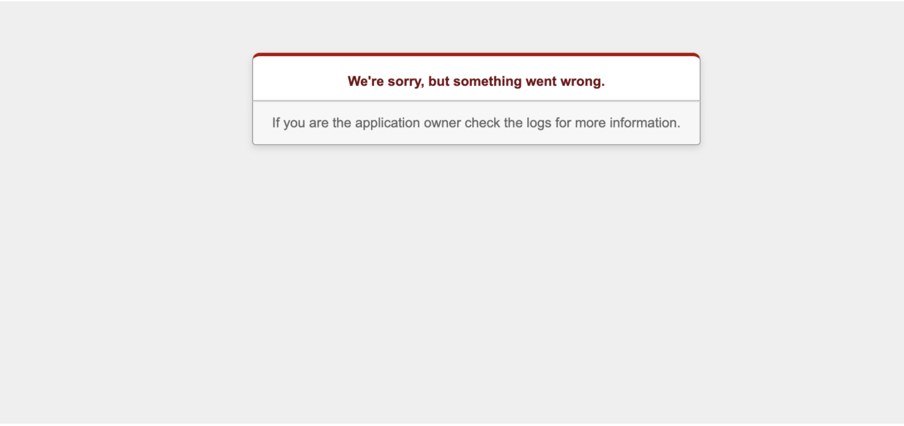

## はじめに
やっとのおもいでAWSにRails on Railsで作成したアプリケーションをデプロイできた！！  
と感激して本番環境でユーザー登録をしてみたところ、こんな画面が登場して絶望しました。




ただローカル側のテストではすべてパスしているため、本番環境に問題がありそうということが分かったので、様々なパターンでユーザー登録を実行してみたところ「**日本語で登録するときのみ**」上のエラー画面が表示されることが判明した。


## 解決策
### 1. パラメータグループを作成して文字コードを修正する

1. AWSのコンソールから「**RDS**」のページを開く
2. 左のメニューから「**パラメータグループ**」を選択
3. 右上の「**パラメータグループの作成**」を選択
4. パラメータグループファミリーを自身の環境に合わせて選択
5. グループ名・説明は分かりやすい内容をおまかせで入力

パラメータグループが作成されたら一覧に作成したパラメータグループ名があることを確認してください

<br>

### 2. パラメータグループ一覧から作成したグループを選択

ここからパラメータ値の文字コードを編集していきます

1. 右上の「**パラメータの編集**」を選択
2. 「フィルタ パラメータ」の検索欄に[ **character_set** ]と入力
3. 絞り込まれた値を次のように変更する
   1. `character_set_client : utf8`
   2. `character_set_connection : utf8`
   3. `character_set_database : utf8mb4`
   4. `character_set_results : utf8`
   5. `character_set_server : utf8mb4`

	
4. 検索欄に[ **skip-character** ]と入力
   1. `skip-character-set-client-handshake : 1`


5. 変更が完了したら右上の「**変更の保存**」を選択

パラメータグループの作成・編集が完了したら、データベースに作成したパラメータグループを適用させます。

<br>

### 3. データベースのパラメータグループを変更
1. 左のメニューから「**データベース**」を選択
2. パラメータグループを設定したいDBを選択
3. 右上の「**変更**」を選択
4. データベース設定 > DB パラメータグループの欄で先程作成したパラメータグループを選択
5. 「**次へ**」を選択
6. 変更スケジュールを「**すぐに適用**」を選んで保存

<br>

変更を保存した後、データベースの概要から「設定」タブを選択して、パラメータグループが「**同期中**」になるのを待ちます（15分ぐらい待ちました）

同期中になったのを確認したら、右上の「**アクション**」から「**再起動**」を選択して、概要の情報が「**利用可能**」になるのを待ちます。

<br>

## 4. 本番環境のデータベースをリセット・作成
1. terminal からEC2にログイン

```bash
$ ssh -i ~/.ssh/xxxxx.pem user@xx.xxx.xxx.xxx
```
<br>

2. プロジェクトのあるディレクトリに移動してDBをdropする

```bash
[xxx@xx.xxx.xxx.xxx] $ cd myapp

[xxx@xx.xxx.xxx.xxx myapp] $ docker-compose run web bundle exec rails db:drop RAILS_ENV=production DISABLE_DATABASE_ENVIRONMENT_CHECK=1
```

<br>

3. データベースを作成してmigrateする

```bash
[xxx@xx.xxx.xxx.xxx myapp] $ docker-compose run web bundle exec rails db:create RAILS_ENV=production

[xxx@xx.xxx.xxx.xxx myapp] $ docker-compose run web bundle exec rails db:migrate RAILS_ENV=production
```


`docker-compose up`して、日本語でユーザー登録してみたところ無事に登録が完了してくれました！


## 参考
[Elastic Beanstalkで一緒に作ったMySQLの日本語対応 | Qiita](https://qiita.com/rh_taro/items/93e8f33f267bec09f91b)
[本番環境のdbをリセットする方法 | Qiita](https://qiita.com/potterqaz/items/ea6db5c5be2be389c0bb)
