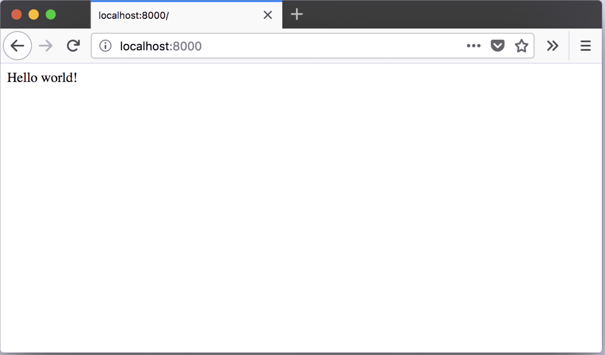
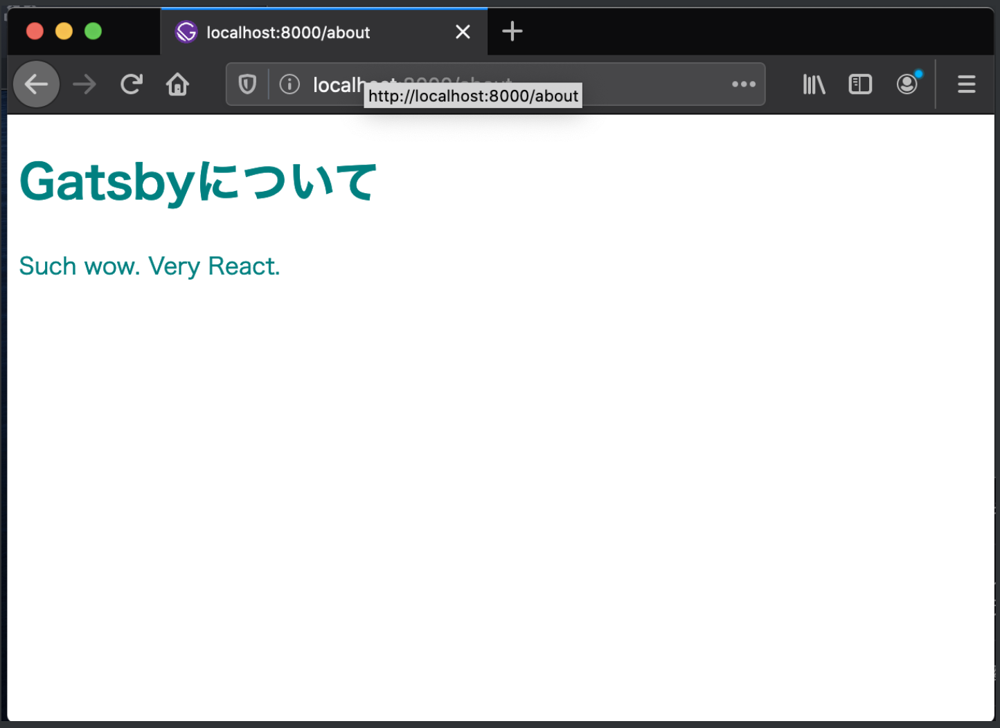
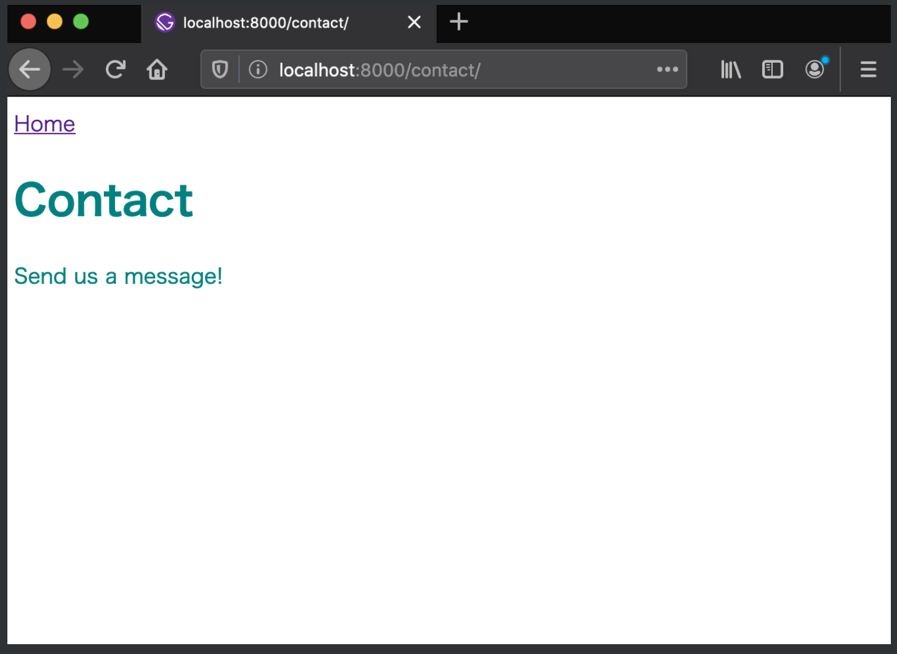

せっかくGatsbyでブログを作成してみたで「Gatsbyチュートリアル」をやってみました。本家のチュートリアルページは英語なので、翻訳機能を駆使して実施した手順などを解説してい見ます。  

<br>

Reactも触ったことがなかったのでこの機会にGatsby + Reactを勉強してみたいと思います。
これでブログをカスタマイズできるようになるはずです。  

[Gatsby チュートリアル](https://www.gatsbyjs.org/tutorial/)

<br>

まずはご自身の環境に合わせて下記リンクを参考に構築していきます。  
[Gatsby チュートリアル](https://www.gatsbyjs.org/tutorial/part-zero/)  
僕の場合は、既に色々インストールしてあったので、実際にサイトを作成するところから始めていきます。  

## Gatsbyでサイトを作成する
まずはGatsbyを使用したサイトを素早くコマンドで作成するため「Gatsby CLI」をnpmからグローバルにインストールします。  

```bash
$ npm install -g gatsby-cli
```

<br>

次に`gatsby new`で「スターター」をダウンロードしてサイト作成を始めます。  

スターターとは、デフォルトで部分的に構築がされているテンプレートのようなもので、WordPressでいう「テーマ」のようなもののイメージです。  
Gatsbyには、数多くのスターターが用意されており、スターターによってはダウンロードしてすぐに使い始めることができるスターターもあります。  
[こちらで様々なスターターを確認できます](https://www.gatsbyjs.org/starters?v=2)

<br>

```bash
$ gatsby new hello-world https://github.com/gatsbyjs/gatsby-starter-hello-world
```

コマンドの詳細  
- `new` 新しいGatsbyプロジェクトを作成
- `hello-world`の部分は任意に設定できるタイトルで、「hello-world」というディレクトリが作成されソースコードが配置される
- GitHubのURLは使用するスターターのコードを保持するリポジトリを指定

<br>

## 開発モードで開始する
ダウンロードが完了したら生成されたディレクトリに移動して、開発モードで開始します


```bash
$ cd hello-world
$ gatsby develop
```

<br>

上のコードを実行することで、開発サーバーが起動されローカル上での開発が可能になります。  
ブラウザで`localhost:8000`にアクセスすることで確認することができます。


<br>
<br>


## 変更を加える
現在はただ「Hello world!」と表示されているだけなので、「Hellow Gatsby!」に変更を加えてみます。  
変更を加えるファイルは`src/pages/index.js`です

```jsx
import React from "react"

export default function Home() {
  // return <div>Hello world!</div>
  return <div>Hello Gatsby!</div>
}
```

<br>

保存することでブラウザに自動で反映されています。  
「Hello Gatsby!」と表示されていれば成功です。


<br>

次に簡単なスタイルを適用させてみます。
```jsx
import React from "react"

export default function Home() {
  return <div style={{ color: `purple`, fontSize: `72px` }}>Hello Gatsby!</div>
}
```

<br>
これで文字色と大きさが変わっているはずです。  
また更に変更を加えます。

```jsx
import React from "react"

export default function Home() {
  return (
    <div style={{ color: `purple` }}>
      <h1>Hello Gatsby!</h1>
      <p>What a world.</p>
    </div>
  )
}
```


<br>
<br>

### 画像を表示させる
画像を表示させて見ます。  
画像は「unsplash」のランダムな画像を使用しています。
```jsx
import React from "react"

export default function Home() {
  return (
    <div style={{ color: `purple` }}>
      <h1>Hello Gatsby!</h1>
      <p>What a world.</p>
      
    </div>
  ) 
}
```

<br>

## ReactとはJSXについて
これまで紹介されていいるソースコードはReactを触ったことがない人にとっては少し不思議なコードになっていると思います。個人的には不思議に感じました。  

この構文はJSXと呼ばれるJavaScriptの拡張版が使われており、HTMLとCSS、JavaScriptが同じファイルで結合されて使用されておりUIのセクションが自己完結型になっています。いわゆるハイブリット的な感覚です。  

次の例を見てみます
```html
<button class="primary-button">Click me</button>
```
上のような普通のHTMLであれば、classの`.primary-button`をCSSで指定して独自のスタイルを適用させて行きます。

<br>

```jsx
<PrimaryButton>Click me</PrimaryButton>
```

JSXでは、PrimaryButton スタイルを使用してタグを作成しています。


<br>

## ページを追加する
`src/pages/xxx.js`のようにファイルを作成するだけで自動的にページとして認識されます。  

確認のため`src/pages/about.js`ファイルを作成して次のコードを記述します。
```jsx
import React from "react"

// Aboutページを追加
export default function About() {
  return (
    <div style={{ color: `teal` }}>
      <h1>About Gatsby</h1>
      <p>Such wow. Very React.</p>
    </div>
  )
}
```

保存後`http://localhost:8000/about/`へアクセスしてページが追加されていることを確認します。

<br>


`about.js`ファイルを配置するだけでページが作成されアクセスできるようになりました。


<br>

## コンポーネントを使用してソースコードの肥大化を防ぐ
Aboutページやトップページの1つのファイルに全てを記述していくと、ファイルが大きくなってしまいます。  
それを防ぐためにコンポーネントというものがReactには存在しており、UIを再利用可能な部分で分割することができます。

今回は`index.js`と`about.js`に共通している`<h1>`の部分を切り出して再利用していきます。  


まずは分割したコンポーネントを格納するための`src`ディレクトリ配下に`components`ディレクトリを作成します。  
```bash
$ mkdir src/components
```

<br>

作成した`components`ディレクトリ内に`header.js`ファイルを作成して次のコードを記述します。
```bash
$ touch src/components/header.js
```

```jsx
import React from "react"

export default function Header() {
  return <h1>This is a header.</h1>
}
```

<br>

続いて、`about.js`ファイルを編集して`Header`コンポーネントをインポートします。
```jsx
import React from "react"
import Header from "../components/header" // コンポーネントをインポート

export default function About() {
  return (
    <div style={{ color: `teal` }}>
      {/* <h1>を<Header />に置き換える */}
      <Header />
      <p>Such wow. Very React.</p>
    </div>
  )
}
```

`header.js`の記述が適用されます。  


ただ、今の状態では他のページで再利用したとき「This is a header」とされてしまうため、より再利用しやすいように、`header.js`を呼び出したページから`<h1>`のテキストに変更を加えられるようにしておきましょう。

<br>

`src/components/header.js`

```jsx
import React from "react"

// propsを追記
export default function Header(props) {
  return <h1>{props.headerText}</h1>
}
```

<br>

`src/pages/about.js`
```jsx
import React from "react"
import Header from "../components/header" // コンポーネントをインポート

export default function About() {
  return (
    <div style={{ color: `teal` }}>
      <Header headerText="Gatsbyについて" />
      <p>Such wow. Very React.</p>
    </div>
  )
}
```

<br>


`about.js`で指定した文字列が表示されるようになりました。

<br>

## propsとは
`props`とはReactコンポーネントで提供されているプロパティです。  
`props`を使うことでよりコンポーネントの再利用性が向上しました。


```jsx
import React from "react"
import Header from "../components/header"

export default function About() {
  return (
    <div style={{ color: `teal` }}>
      {/* 同一のコンポーネントから異なる文字列が使用できる */}
      <Header headerText="Gatsbyについて" />
      <Header headerText="It's pretty cool" />
      <p>Such wow. Very React.</p>
    </div>
  )
}
```

<br>

## リンクを配置する
今回は`contact`ページのリンクを配置していきます。
`src/pages/index.js`
```jsx
import React from "react"
import { Link } from "gatsby" // Gatsbyコンポーネントをインポート
import Header from "../components/header"

export default function Home() {
  return (
    <div style={{ color: `purple` }}>
      <Link to="/contact/">Contact</Link>
      <Header headerText="Hello Gatsby!" />
      <p>What a world.</p>
      
    </div>
  )
}
```

- Gatsbyからコンポーネントをインポート
- `<Link />`を追加して、パス名は`to`プロパティを使って設定

<br>


現時点ではまだ存在しないページにリンクしているため`404`と表示されています。  
では`contact`を追加していきます。

<br>

先程のAboutページ同様`contact.js`ファイルを作成します。  
`src/pages/contact.js`
```jsx
import React from "react"
import { Link } from "gatsby"
import Header from "../components/header"

export default function Contact() {
  return (
    <div style={{ color: `teal` }}>
      <Link to="/">Home</Link>
      <Header headerText="Contact" />
      <p>Send us a message!</p>
    </div>
  )
}
```

<br>



Contactページが表示され`Home`へのリンクが動作していれば完了です。  

※Gatsbyの`<Link />`コンポーネントは、サイト内のページ間リンクとして使用するものなので、外部サイトへリンクさせたい場合は、通常の`<a>`タグを使用します.


<br>

## Gatsbyサイトをデプロイ
Gatsbyは静的サイトジェネレーターのため、サーバーやデータベースを持ちません。そのため静的サイトをホスティングサービスを利用することで簡単にデプロイすることができます。  

静的サイトジェネレーターとは、コンパイル時にHTMLを生成してくれるツールのとこを言、静的サイトジェネレーターにはいくつか種類がありGatsbyはその中の一つになります。  

詳しく静的サイトジェネレーターについて知りたい方はこちらの記事が参考になるかと思います。  
参考:[静的サイトジェネレーターについて](https://qiita.com/umamichi/items/9bd08a21fddc71588efc)


<br>

Gatsbyチュートリアルでは「Surge」という静的サイトホスティングサービスを利用しています。  
まずは「Surge」コマンドツールをインストールします。
```bash
$ npm install --global surge
```

次にビルドコマンドを実行してサイトを構築します。  
*次のコマンドはルートディレクトリで実行して下さい*
```bash
$ gatsby build
```
上のコマンドを実行すると`public`ディレクトリが生成されます。  
ではデプロイしていきます。

```bash
$ surge public/
```
このコマンドを実行すると、サイトを公開する前にアカウント登録を要求されるのでメールアドレスとパスワードを設定します。その後設定したメールアドレス宛に確認メールが送信されるのでメールで認証確認を終えておきましょう。

`domain: xxxxxxxx.sh`と表示されたらそのままEnterを押し最後にURLが表示されるので、アクセスすることで確認できます。  


これでサイトのデプロイが完了しました。  
以前AWSに`Ruby on Rails`で構築したアプリケーションを1週間近くかけてデプロイした苦労があるのでここまで簡単にデプロイできることに感動してしまいました。


次回は「Gatsbyチュートリアルをやってみた２章」に続きます。