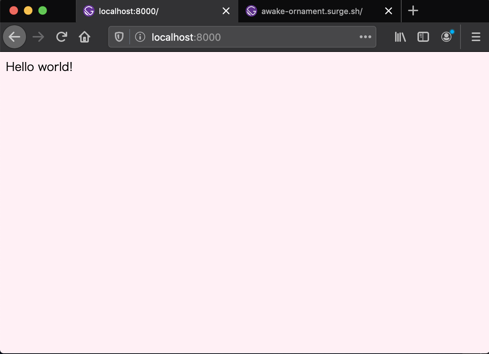
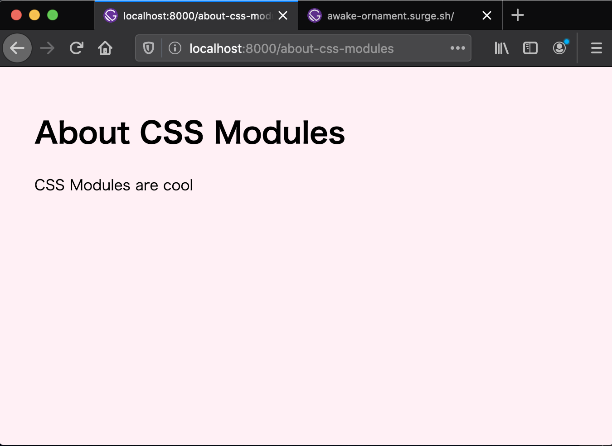
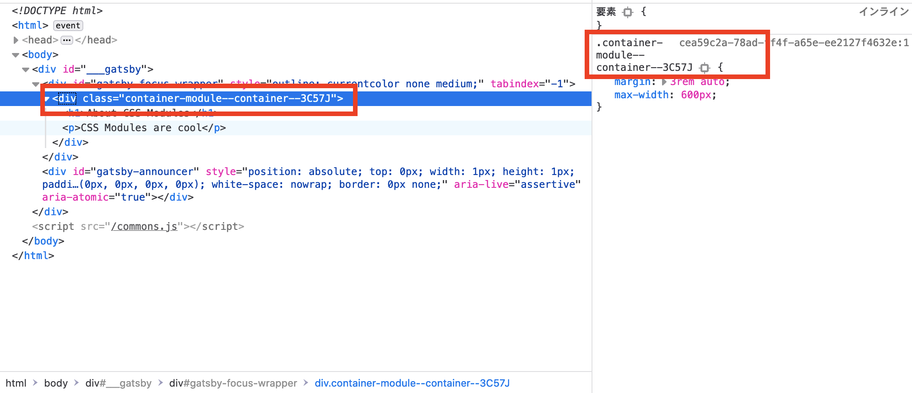
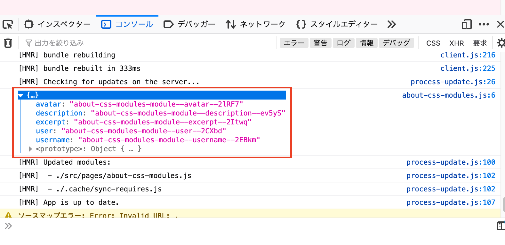
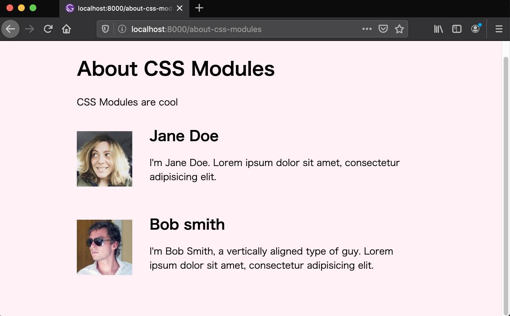

[Gatsby チュートリアル Part2](https://www.gatsbyjs.org/tutorial/part-two/)

<br>

2章では、GatsbyのWEBサイトにスタイルを設定するためオプション使っていきます。

<br>

## グローバルスタイルを使う
世の中の全てのサイトには、サイトの背景色やフォントスタイルなどのある種のグローバルスタイルがあります。グローバルスタイルには、サイト全体の雰囲気や世界観を設定していきます。

<br>

## 新たにサイトを作成する
前回と同じように`Gatsby new`を実行して新たなプロジェクトを作成します。
```bash
$ gatsby new tutorial-part-two https://github.com/gatsbyjs/gatsby-starter-hello-world
```
<br>

スターターのダウンロードが完了したらプロジェクトに移動します
```bash
$ cd tutorial-part-two
```
<br>  

## CSSファイルにスタイルを追加する
`src`ディレクリ配下に`styles`ディレクトリと作成した`styles`ディレクトリ配下に`global.css`ファイルを作成します。
```bash
$ mkdir src/styles
$ touch src/styles/global.css
```
<br>
  
次のような構造になっていると思います。
```
├── package.json
├── src
│   ├── pages
│   |   └── index.js
│   └── styles
│       └── global.css
```
<br>

`global.css`ファイルにスタイルを定義します。
```css
html {
  background-color: lavenderblush;
}
```

<br>

次に`gatsby-browser.js`ファイルをルートディレクトリに作成します。
ファイル構成は以下になります。
```
├── package.json
├── src
│   ├── pages
│   |   └── index.js
│   └── styles
│       └── global.css
├─── gatsby-browser.js
```

<br>  

作成した`gatsby-browser.js`ファイルに`global.css`をインポートしていきます。
```jsx
import "./src/styles/global.css"

// または
// require('./src/style/global.css')
```

<br>

開発サーバーを起動していきます。
```bash
$ gatsby develop
```



背景色のスタイルが適用されています。

> ヒント：チュートリアルのこの部分では、Gatsbyサイトのスタイル設定を開始する最も迅速で簡単な方法、つまりを使用して標準のCSSファイルを直接インポートする方法に焦点を当てましたgatsby-browser.js。ほとんどの場合、グローバルスタイルを追加する最良の方法は、共有レイアウトコンポーネントを使用することです。そのアプローチの詳細については、ドキュメントを確認してください。
> 
[Gatsbyドキュメント](https://www.gatsbyjs.org/docs/global-css/)

<br>

## CSSをモジュール化してコンポーネント指向にスタイルする

CSSモジュールは、自動的に一意のクラス名とアニメーション名を生成するので、セレクター名の衝突する心配がありません。

Gatsbyでは、CSSモジュールをそのまま使用することができます。

<br>

### CSSモジュールを使用して新しいページを作成する
新しいページを作成して、CSSモジュールを使って作成したページにスタイルを適用させていきます。

`src`配下に`components`ディレクトリを作成し、`container.js`ファイルを作成します。
```bash
$ mkdir components
$ touch components
```

<br>

`src/components/container.js`
```jsx
import React from "react"
// CSSモジュールファイルをインポート
import containerStyles from "./container.module.css"

export default function Container({ childre }) {
  return <div className={containerStyles.container}>{children}</div>
}
```

<br>

まだインポートしている`contaner.module.css`ファイルはないので、作成します。

```bash
$ touch src/components/container.module.css
```

<br>


`src/components`
```css
.container {
  margin: 3rem auto;
  max-width: 600px;
```

ファイル名が`.module.css`となっているのは、CSSファイルをモジュールとして処理するようGatsbyに指示するためです。

<br>

`about-css-modules.js`ファイルを作成し新しいページを作成します。
```bash
touch src/pages/about-css-modules.js
```

<br>

`src/pages/about-css-modules.js`
```jsx
import React from "react"

import Container from "../components/container"

export default function About() {
  return (
    <Container>
      <h1>About CSS Modules</h1>
      <p>CSS Modules are cool</p>
    </Container>
  )
}
```

次のURLにアクセスしてみます。
`http://localhost:8000/about-css-modules/`



<br>

少しだけ複雑になったのでちょっと整理してみます。


`container.module.css`
```css
.container {
  margin: 3rem auto;
  max-width: 600px;
}
```

<br>

`container.module.css`で定義されたスタイルはコンポーネントである`src/components/contaner.js`の`<div>`タグに適用されます。

```jsx
import React from "react"
// CSSファイルをインポート
import containerStyles from "./container.module.css"

export default function Container({ children }) {
  // インポートしたcontainer.module.css内で.containerというクラス名を指定することでスタイルが適用される
  return <div className={containerStyles.container}>{children}</div>
}
```

<br>

`import containerStyles from ....`とインポートしているので、`return <div className={containerStyles...}`と指定します。

次に`children`という特別なプロパティを使用していることで、`about-css-modules.js`でコンポーネントを呼び出し、`<Container>`で囲むことで、`<h1>`タグと`<p>`タグを子要素として内包することができます。

<br>

`src/pages/about-css-modules.js`
```jsx
import React from "react"
// コンポーネントをインポート
import Container from "../components/container"

export default function About() {
  return (
    {/* コンポーネントタグで子要素として内包させたいタグを囲む */}
    <Container>
      <h1>About CSS Modules</h1>
      <p>CSS Modules are cool</p>
    </Container>
  )
}
```

<br>

ブラウザのデベロッパーツールどのようなクラス名で指定されているか確認してみます。


しっかりクラス名に一意の値が設定され、そのクラス名をCSSで指定してくれています。

<br>

### CSSモジュールでコンポーネントのスタイルを適用する
新しいCSSファイルを作成します。
```bash
$ touch src/pages/about-css-modules.module.css
```

下記コードを作成したCSSファイルに記述します
`src/pages/about-css-modules.module.css`
```css
.user {
  display: flex;
  align-items: center;
  margin: 0 auto 12px auto;
}

.user:last-child {
  margin-bottom: 0;
}

.avatar {
  flex: 0 0 96px;
  width: 96px;
  height: 96px;
  margin: 0;
}

.description {
  flex: 1;
  margin-left: 18px;
  padding: 12px;
}

.username {
  margin: 0 0 12px 0;
  padding: 0;
}

.excerpt {
  margin: 0;
}
```

<br>

`src/pages/about-css-modules.js`に先程作成したCSSファイルをインポートします。
```jsx
import React from "react"
// cssをインポート
import styles from "./about-css-modules.module.css"
import Container from "../components/container"

// 処理結果を確認できる
console.log(styles)

export default function About() {
  return (
    <Container>
      <h1>About CSS Modules</h1>
      <p>CSS Modules are cool</p>
    </Container>
  )
}
```


JavaScriptのように`console.log(...)`を使うことができます。デベロッパーツールのコンソールで確認してみます。

<br>


確認してみるとそれぞれクラス名が生成されているのがわかります。このクラス名はCSSモジュールが作り出しています。

<br>

次は、`<User />`をインラインで`about-css-modules.js`に追加していきます。
`src/pages/about-css-modules.js`
```jsx{7-15, 23-35}
import React from "react"
import styles from "./about-css-modules.module.css"
import Container from "../components/container"

console.log(styles)

const User = props => (
  <div className={styles.user}>
    
    <div className={styles.description}>
      <h2 className={styles.username}>{props.username}</h2>
      <p className={styles.except}>{props.excerpt}</p>
    </div>
  </div>
)

export default function About() {
  return (
    <Container>
      <h1>About CSS Modules</h1>
      <p>CSS Modules are cool</p>

      <User
        username="Jane Doe"
        avatar="https://s3.amazonaws.com/uifaces/faces/twitter/adellecharles/128.jpg"
        excerpt="I'm Jane Doe. Lorem ipsum dolor sit amet, consectetur adipisicing elit."
      />
      <User
        username="Bob smith"
        avatar="https://s3.amazonaws.com/uifaces/faces/twitter/vladarbatov/128.jpg"
        excerpt="I'm Bob Smith, a vertically aligned type of guy. Lorem ipsum dolor sit amet, consectetur adipisicing elit."
      />

    </Container>
  )
}
```

<br>

インラインで新しいコンポーネントを作成しています。
```jsx
.
.
.
const User = props => (
  <div className={styles.user}>
    
    <div className={styles.description}>
      <h2 className={styles.username}>{props.username}</h2>
      <p className={styles.except}>{props.excerpt}</p>
    </div>
  </div>
)
.
.
.
```

サイトの複数箇所でコンポーネントを使用する場合は、一般的に`components`ディレクトリ内に分割して配置する必要がありますが、今回は１つのファイルのみで使用する場合は、インラインで使用します。


完成したページを確認してみます。




<br>


無事に簡単なレイアウトを適応させることができました。

いい感じだけどここは繰り返し処理とかできないのかな？
```jsx
<Container>
  <h1>About CSS Modules</h1>
  <p>CSS Modules are cool</p>

  <User
    username="Jane Doe"
    avatar="https://s3.amazonaws.com/uifaces/faces/twitter/adellecharles/128.jpg"
    excerpt="I'm Jane Doe. Lorem ipsum dolor sit amet, consectetur adipisicing elit."
  />
  <User
    username="Bob smith"
    avatar="https://s3.amazonaws.com/uifaces/faces/twitter/vladarbatov/128.jpg"
    excerpt="I'm Bob Smith, a vertically aligned type of guy. Lorem ipsum dolor sit amet, consectetur adipisicing elit."
  />

</Container>
```