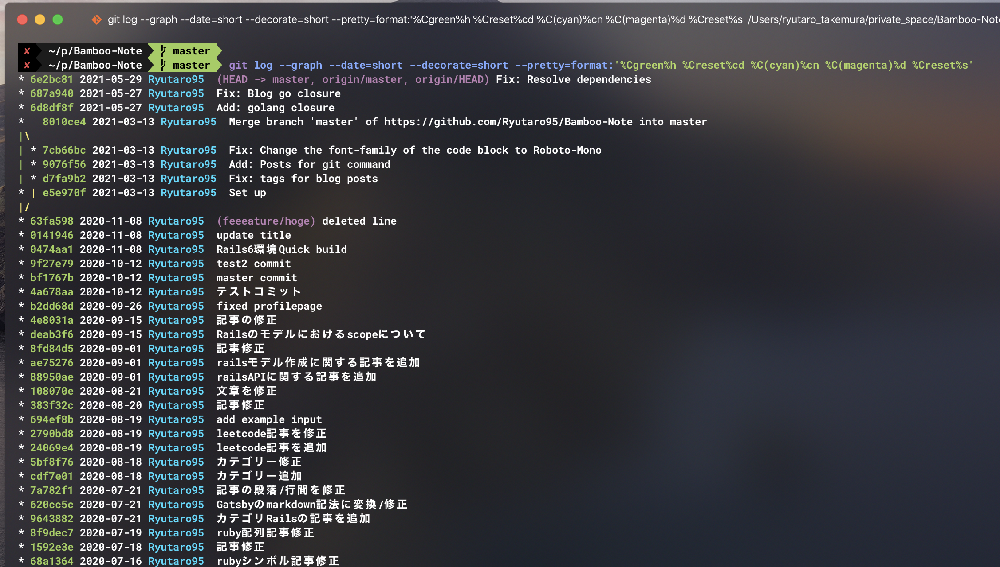

普段SourcetreeでGitを操作しているため、gitコマンドをよく忘れることがあるので残しておきます。


## Git ログを確認する - 追記: 2021/05/29

```bash
$ git log --graph --date=short --decorate=short --pretty=format:'%Cgreen%h %Creset%cd %C(cyan)%cn %C(magenta)%d %Creset%s'
```



<br>

ただオプションが長すぎるので、 .gitconfigなどでaliasを設定する方が良さそう

```bash
# ~/.gitconfig

# ....

[alias]
    gra = log --graph --date=short --decorate=short --pretty=format:'%Cgreen%h %Creset%cd %C(cyan)%cn %C(magenta)%d %Creset%s'
```

これで使いやすくなった。

```bash
$ git gra
```

<br>


## コミットしていない or まだしたくない変更を一時的に退避させる

1. 変更分を退避

```bash
$ git stash save
```

2. 退避した作業一覧

```bash
$ git stash list
stash@{0}: WIP on test: xxx
stash@{1}: WIP on sample: xxx
```

3. 退避した変更を戻す

```bash
$ git stash apply stash@{0}
```

4. 退避した作業を削除

```bash
$ git stash drop stash@{0}
```

## ブランチ名の変更

```bash
$ git branch -m oldブランチ newブランチ
```

現在のブランチ名を変更

```bash
* feeeature/hoge

$ git branch -m feature/hoge

-> * feature/hoge
```


## ローカルブランチを削除したい


1. ローカルブランチを確認

```bash
$ git branch
  * master
  develop
  feature/hoge
```

2. 指定したブランチを削除

```bash
# git branch --delete ブランチ名
# git branch -d ブランチ名

$ git branch -d feature/hoge
Deleted branch feature/hoge (was xxxxxxx)
```


