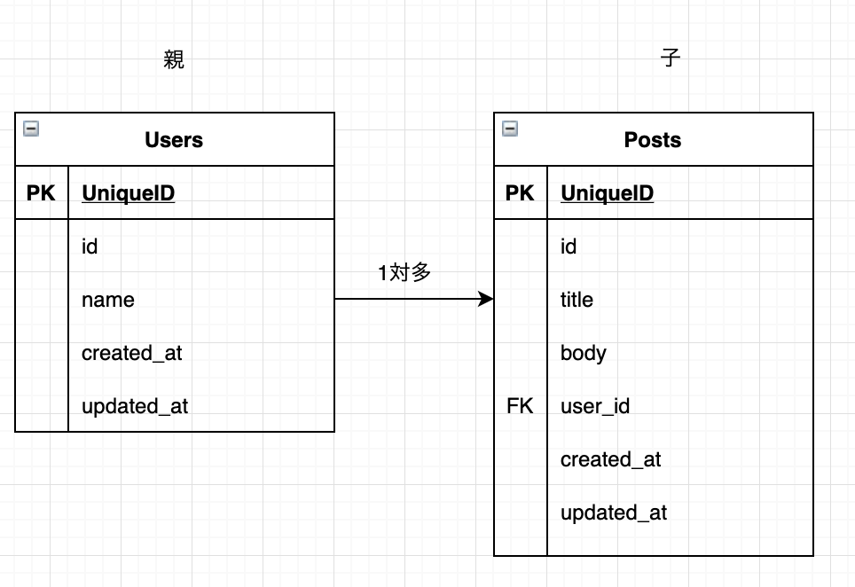

Postモデルを作成する段階で、`user_id`を外部キーとして設定したい


```bash
$ rails g model post title:string body:text user:references
```

<br>


次のmigrationファイルが作成される

```ruby
class CreatePosts < ActiveRecord::Migration[6.0]
  def change
    create_table :posts do |t|
      t.string :title
      t.text :body
      t.references :user, null: false, foreign_key: true

      t.timestamps
    end
  end
end

```

`user_id`が`null:false`として設定されるので、適所ユニーク制約やNOTNULL制約などを設定して`db:migrate`する

```bash
$ rails db:migrate
```


<br>

## スキーマ（schema.rb）
スキーマを確認すると、`bigint`で`user_id`が設定されており、`index`が貼られた状態で作成されていることが分かります。

```ruby
create_table "posts", options: "ENGINE=InnoDB DEFAULT CHARSET=utf8mb4", force: :cascade do |t|
  t.string "title", null: false
  t.text "body", null: false
  t.bigint "user_id", null: false
  t.datetime "created_at", precision: 6, null: false
  t.datetime "updated_at", precision: 6, null: false
  t.index ["user_id"], name: "index_posts_on_user_id"
end

create_table "users", options: "ENGINE=InnoDB DEFAULT CHARSET=utf8mb4", force: :cascade do |t|
  t.string "name", null: false
  t.datetime "created_at", precision: 6, null: false
  t.datetime "updated_at", precision: 6, null: false
end

add_foreign_key "posts", "users"
```
