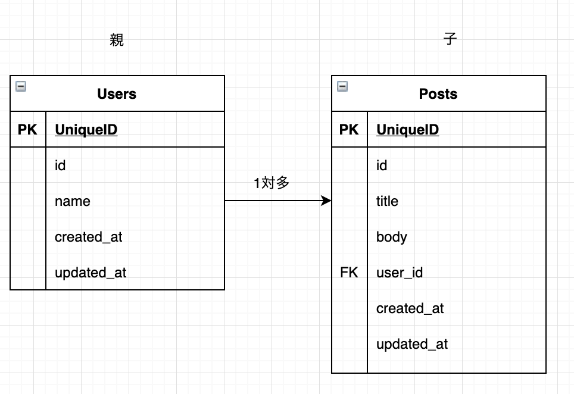

今回のゴールは次のようなレスポンスを返すことです。

期待するレスポンス
```json
{
  "data": [
    {
      "id": 1,
      "title": "Rails APIについて",
      "body": "RailsをAPIモードで作成します。",
      "user": "山田太郎"
    },
    {
      "id": 2,
      "title": "DockerでRails環境を構築",
      "body": "Docker+docker-composeでRails6の環境を構築します。",
      "user": "鈴木一郎"
    },
    {
      "id": 3,
      "title": "MySQLをRials環境で使う",
      "body": "MySQLをRails環境で使用します。",
      "user": "田中三郎"
    }
  ]
}
```

## UsersテーブルとPostsテーブル



<br>


## 背景

ブログ記事（Post）一覧をGETで取得するする際にブログ記事を書いたユーザー（User）も一緒にJSONで返したいとなったときに使います。

<br>


## ルーティングの設定


`GET`で`/posts`にリクエストが来ることを想定しているので、`index`でルーティングの設定をします。
```ruby
Rails.application.routes.draw do
  resources :posts, only: %i[index]
end
```

### エンドポイント

```
http://localhost:3000/posts
```

<br>


今回レスポンスとして返したい情報は次のような`posts`テーブルの`id`, `title`, `body`と`users`テーブルの`name`のみとします。そのため`created_at`や`updated_at`、`user.id`などは不要な情報なので省きたいです。


## モデルの作成
UserモデルとPostモデルを作成します。

```bash
$ rails g model user name:string
```

```bash
$ rails g model post title:string body:text user:references
```

<br>

```ruby
$ rails db:migrate
```

<br>

## リレーションを設定

ユーザーは複数のブログ記事を持ち、ブログ記事は１人のユーザーに紐づくため、1対多のリレーションを設定します。

```ruby
# user.rb（Userモデル）
class User < ApplicationRecord
  has_many :posts
end


# post.rb（Postモデル）
class Post < ApplicationRecord
  belongs_to :user
end
```

<br>

## seedでデータを作成

記事一覧を呼び出したいので、ユーザーとそれに紐づくブログ記事を作成します。

- seed.rb

```ruby
User.create(name: "山田太郎").posts.create(title: "Rails APIについて", body: "RailsをAPIモードで作成します。")
User.create(name: "鈴木一郎").posts.create(title: "DockerでRails環境を構築", body: "Docker+docker-composeでRails6の環境を構築します。")
User.create(name: "田中三郎").posts.create(title: "MySQLをRials環境で使う", body: "MySQLをRails環境で使用します。")

```

<br>


```bash
$ rails db:seed
```


<br>

## postsコントローラーを作成

postsコントローラとindexアクションを作成します。

```bash
$ rails g controller posts index
```

<br>

まずは、全てのブログ記事を取得して、jsonで返却してみます。

```ruby
class PostsController < ApplicationController
  def index
    posts = Post.all

    render json: { data: posts }
  end
end

```

#### ※postmanを使用して確認します

[Postman](https://www.postman.com/)をお持ちでない方はインストールして確認してみてください。


GET: [http://localhost:3000/posts](http://localhost:3000/posts)として「send」をクリックします。

すると次のように、ブログ記事一覧が表示されます。


ここでは、`posts`テーブルの全てのカラム情報がレスポンスとして帰ってきており、ユーザー名もないので必要な情報を入れて、不要な情報はレスポンスとして帰ってこないようにしたいです。


<br>

## 本題「必要な情報だけを返却したい」


- posts_controller.rb

```ruby
class PostsController < ApplicationController
  def index
    posts = User.joins(:posts).select('posts.id, title, body, name AS user')

    render json: { data: posts }
  end
end

```

`posts`コントローラを上のように修正しました。まずは結果を確認してみましょう。


無事に必要な情報だけを持つ、ブログ記事一覧の取得ができました。


<br>


## `joins`メソッドと`select`メソッド

<br>

#### joins
`joins`メソッドは2つのテーブルを内部結合することができるメソッドです。
```ruby
# モデル.joins(:関連モデル)
User.joins(:posts)
```

joins、内部結合に関しては次の記事が参考になります。
[Rails における内部結合、外部結合まとめ](https://qiita.com/yuyasat/items/c2ad37b5a24a58ee3d30)

`joins`メソッドを使って、`users`テーブルと`posts`テーブルを内部結合させます。


<br>

#### select

内部結合させたあとに、`select`メソッドを使って、必要なカラムを指定して取得します。
```ruby
.select('posts.id, title, body, name AS user')
```

- ここで`posts.id`となっているのは、テーブル同士でカラム名が重複している場合、テーブルを指定して`id`を取得しています。`title`や`body`などの重複していないカラムはそのまま指定することができます。

- `name AS user`としているのは、`users`テーブルの`name`カラム名を表示用に`user`と変更しています。`posts`テーブルのカラムと一緒に返却しているため`name`だと分かりづらいため`user`に変更しています。


## 実行されたSQLを確認

```sql
SELECT posts.id, title, body, name AS user FROM `users` INNER JOIN `posts` ON `posts`.`user_id` = `users`.`id`
```